# 🌟 Welcome to My Digital Universe

<div align="center">
  
  

  
  
  [](https://sangamesh.vercel.app/)
  [](https://dev.to/vedangit)
  [](https://www.linkedin.com/in/vedangi-thokal-528037249/)
  [](https://twitter.com/Vedangitt)

</div>

---

## 🎯 About Me
```javascript
const developer = {
    name: "Sangamesh",
    role: "Full Stack Developer & SaaS Tool Builder",
    location: "India 🇮🇳",
    currentFocus: ["Backend", "Cloud Architecture", "DevOps", "Frontend"],
    philosophy: "Building elegant solutions to everyday problems",
    
    askMeAbout: ["Web Dev", "AI/ML", "SaaS", "Tech Blogging"],
    funFact: "I turn coffee ☕ into code and minor inconveniences into apps",
    
    challenge: "Tell me your daily inconvenience, I'll code a solution! 🚀"
};
```

<div align="center">
  
  ### 💡 **My Superpower?** 
  *Solving minor inconveniences with major code!*
  
  🔧 Got a repetitive task? Let's automate it.  
  🐛 Found a bug in real life? Let's patch it with software.  
  ⚡ Life throwing friction? Let's code some WD-40.

</div>

---

## 🛠️ Tech Arsenal

<div align="center">

### 🎨 Frontend Magic


### ⚙️ Backend Power


### ☁️ Cloud & DevOps


### 🤖 AI/ML & Data Science


### 🔧 Languages & Tools


</div>

---

## 📊 GitHub Stats

<div align="center">
  
  
  
  
</div>

<div align="center">
  
  
  
</div>

<div align="center">
  
  
  
</div>

---

## 🏆 GitHub Trophies

<div align="center">
  
  
  
</div>

---

## ✍️ Latest Blog Posts

<!-- BLOG-POST-LIST:START -->
- 📝 Check out my articles on [Dev.to](https://dev.to/vedangit) 
- 🎯 Trusted Member Badge Holder ✨
- 💡 Writing about Web Development, AI/ML, and SaaS Development
<!-- BLOG-POST-LIST:END -->

---

## 🎨 Featured Projects

<div align="center">

<!-- Replace with your actual repositories -->
[](https://github.com/sangamesh-Lingshetty/your-project-1)
[](https://github.com/sangamesh-Lingshetty/your-project-2)

</div>

---

## 💼 What I Do

```mermaid
graph LR
    A[💡 Idea] --> B[🎨 Design]
    B --> C[💻 Develop]
    C --> D[☁️ Deploy]
    D --> E[🚀 Scale]
    E --> F[🔄 Iterate]
    F --> A
```

<div align="center">


</div>

### 🎯 Specializations

- **🏗️ SaaS Development**: Building scalable software-as-a-service applications
- **☁️ Cloud Architecture**: Designing and implementing cloud-native solutions
- **🔧 DevOps**: Automating workflows and continuous integration/deployment
- **🤖 AI/ML Integration**: Implementing intelligent features in web applications
- **📱 Full Stack Development**: End-to-end application development

---

## 💬 Let's Connect!

<div align="center">

### 💡 Have a minor inconvenience? Let's solve it together!

I love turning everyday frustrations into code solutions. Whether it's a repetitive task, a clunky workflow, or just something that annoys you - **tell me about it, and I'll try to build something to fix it!**

[](mailto:your.email@example.com)
[](https://sangamesh.vercel.app/)
[](https://www.linkedin.com/in/vedangi-thokal-528037249/)

</div>

---

<div align="center">

### 📈 Profile Stats


</div>

---

<div align="center">
  
  ### 🌟 "Code is poetry written in logic" 🌟
  
  
  
  **Thanks for stopping by! Let's build something amazing together!** 🚀
  
  
  
</div>
